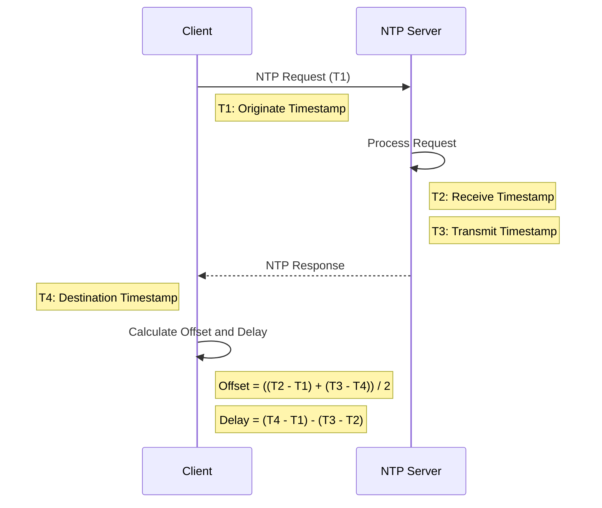

# NTP Server Monitor

## Overview

NTP Server Monitor is a Python-based command-line application that allows you to monitor multiple Network Time Protocol (NTP) servers simultaneously. It provides real-time information about server performance, time synchronization, and detailed NTP packet data.

## Features

- Monitor multiple NTP servers in real-time
- Display key metrics for each server:
  - Round Trip Time (RTT)
  - Time Offset
  - NTP Time
  - Root Delay
  - Root Dispersion
  - Stratum
- Show current, minimum, and maximum values for each metric
- Auto-update data every 5 seconds
- Color-coded interface with multiple color schemes
- Detailed view for each server with comprehensive NTP packet information
- Built-in help page explaining all displayed information and commands

## NTP Sequence Diagram

Below is a UML sequence diagram illustrating the basic NTP synchronization process:



This diagram shows:
1. The client sends an NTP request to the server, recording the originate timestamp (T1).
2. The server receives the request (T2) and processes it.
3. The server sends a response (T3) back to the client.
4. The client receives the response and records the destination timestamp (T4).
5. The client then calculates the time offset and network delay.

## Requirements

- Python 3.6 or higher
- ntplib library
- curses library (usually comes pre-installed with Python)

## Installation

1. Clone this repository or download the script:

   ```
   git clone https://github.com/vovkes/ntp-server-monitor.git
   cd ntp-server-monitor
   ```

2. Create a virtual environment (optional but recommended):

   ```
   python3 -m venv ntp_monitor_env
   source ntp_monitor_env/bin/activate
   ```

3. Install the required library:

   ```
   pip install ntplib
   ```

## Usage

Run the script using Python:

```
python3 ntp_monitor.py
```

### Controls

- Use Up/Down arrow keys to navigate the server list
- Press 'c' to change the color scheme
- Press 'h' to view the help page
- Press 'd' to view detailed information for the selected server
- Press 'q' to quit the application (or return to the main view from the detailed view)

## Customization

You can customize the list of NTP servers by modifying the `NTP_SERVERS` list at the beginning of the script.

## Contributing

Contributions, issues, and feature requests are welcome. Feel free to check [issues page](https://github.com/vovkes/ntp-server-monitor/issues) if you want to contribute.

## License

[MIT](https://choosealicense.com/licenses/mit/)

## Author

vovkes - [vovkes@overtheworld.uk](mailto:vovkes@overtheworld.uk)

## Acknowledgments

- ntplib developers
- Python curses library maintainers
